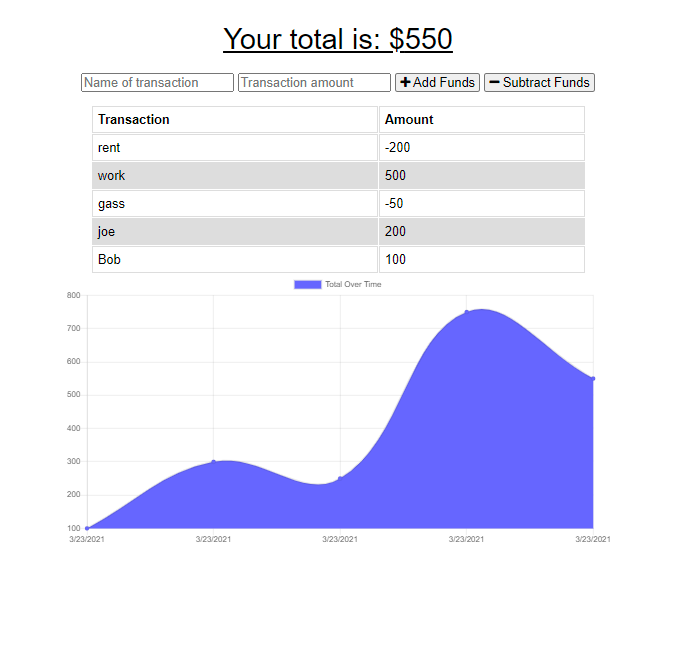

# Budget Trackers

  [Link to webpage](https://whispering-forest-73448.herokuapp.com/)
  
  As a user that travels i want to be able to track my withdrawals and deposits with or without a data/internet connection so that my account balance is accurate when i am traveling  
    
  ## Table of Content
  [-Installation](#Installation)  
  [-Description](#Description)    
  [-Usage](#Usage)  
  [-Questions](#Questions)  
  
  
  ## Installation  
  npm install and npm start to run.

  ## Description  
  Giving users a easy way to track their money, and allowing them to access that information anytime is important. The offline functionality is key for making this app viable. Online this project works with a NO-SQL database, while offline it works with IndexDB, which when turned online again will update the NO-SQL database.

  ## Usage  
  When users wants to track their monetary transaction both online and offline.
  
  ## Questions?  
  
    My Github link is [Nvrtis](https://github.com/Nvrtis)
    Any futher questions can be sent to my email here  <Nvav91@gmail.com>
